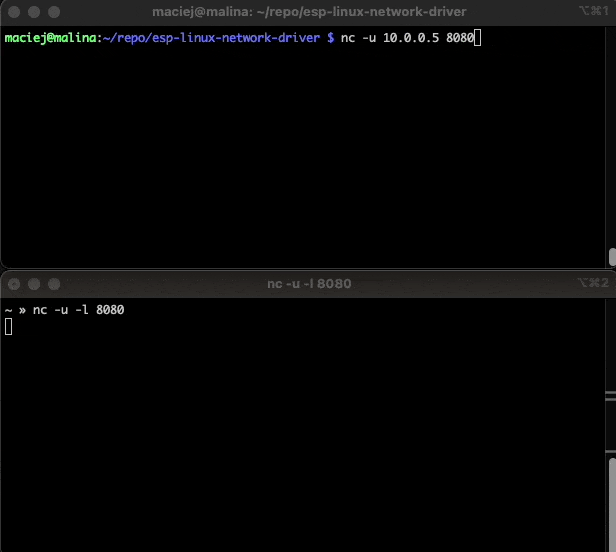
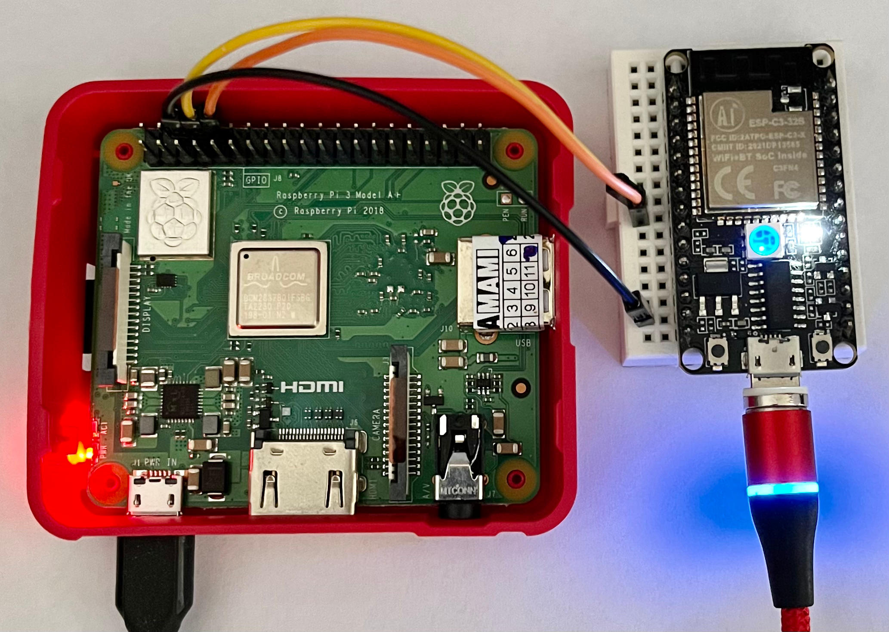

# Linux Network Driver for ESP32 C3
This repository contains Linux kernel driver that uses ESP32 C3 as a wireless network adapter.  
Overview:
* Based on the `cfg80211` subsystem
* Device Tree support
* Uses UART  
* Supports Wi-Fi scanning, connecting and disconnecting from networks
* Uses default ESP32 C3 AT firmware

## Demo
Sending data from RPi to my computer:

## Using the driver
The following steps show how to build and use the driver on target system, RPi 3A+ has been used as an example:
* Run `make` in the cloned repository to build the kernel module
* Build the device tree overlay: `dtc -@ -I dts -O dtb -o espnetcard.dtbo dt/pi3a.dts`
* Move the `espnetcard.dtbo` overlay to `/boot/overlays`
* Enable the overlay by appending `dtoverlay=espnetcard` to the `/boot/config.txt` file
* Restart the RPi
* Load the module: `sudo insmod espnet.ko`

Required packages: `linux-headers`, `build-essential`, `device-tree-compiler`
